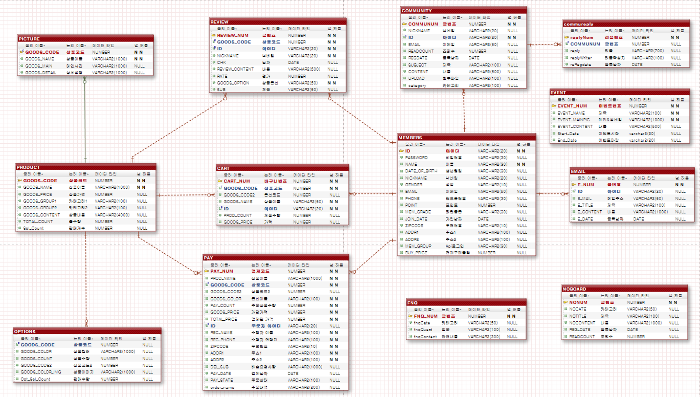

# 개발환경

* SPRING 4.1.7 RELEASE 
* HTML5, JS, Jquery
* Mybatis 
* JSTL, AJAX, CSS

# 개발목표

* 회원들의 원활한 커뮤니티 기능이 구현된 온라인 쇼핑몰
* 관리자의 편리한 관리기능이 구축된 홈페이지를 구축
* 다양한 기능을 가진 홈페이지를 구축

# 맡은역할

* 로그인, 회원가입, 마이페이지, 관리자(최근 본 상품 조회)

# ER-Diagram

